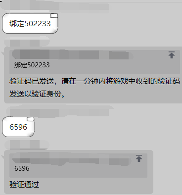
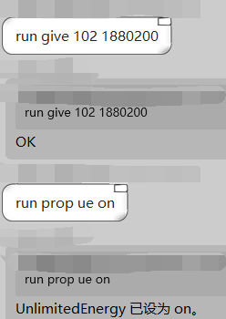
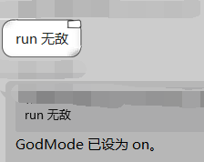
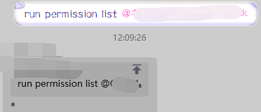
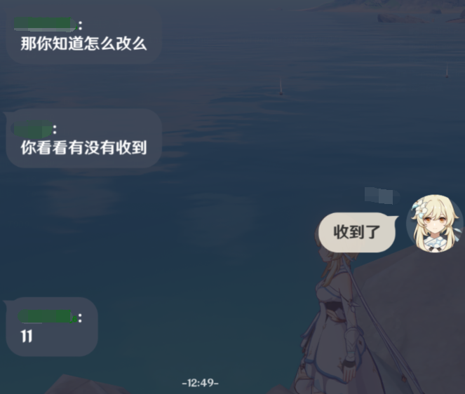

# J Grasscutter Command
# 在QQ群里远程执行命令的插件

- 基于 [Mirai-Console](https://github.com/mamoe/mirai-console) 开发的插件
- 服务端必须使用 [OpenCommand](https://github.com/jie65535/gc-opencommand-plugin) 插件

Mirai机器人相关文档请参阅 [用户手册](https://github.com/mamoe/mirai/blob/dev/docs/UserManual.md)，
本项目**不会教你**如何安装和登录机器人，请自行了解Mirai相关信息。

# 插件用法

## 首先使用指令添加一个服务器
```shell
# 用法
/jgc addServer <address> [name] [description]   # 添加服务器
# 示例
/jgc addServer http://127.0.0.1:443 测试服 本地测试服务器
# 成功返回 "服务器已添加，ID为[1]，使用servers子命令查看服务器列表"
# 失败返回 "只能设置装有 [OpenCommand](https://github.com/jie65535/gc-opencommand-plugin) 插件的服务器"
# 失败的原因可能包含无法链接服务器、服务器没有安装插件等，具体可以参考日志

# 如果你是服主，你可以添加OpenCommand的ConsoleToken
/jgc setServerConsoleToken <id> <consoleToken>
# 添加完成后，你可以将自己设置为管理员
/jgc op <user>
# 例如设置123456为管理员
/jgc op 123456
# 取消管理的子命令是 deop

# 管理员执行命令将默认使用控制台Token，无需验证（见后文）
```

## 将服务器绑定到机器人所在群聊
```shell
# 用法
/jgc linkGroup/bindGroup/addGroup <serverId> [group]   # 绑定服务器到群，在群内执行可忽略群参数
# 示例（控制台）
/jgc linkGroup 1 群号
# 示例（群里）
/jgc linkGroup 1
# 成功返回 "OK"
```
在聊天环境执行 Mirai-Console 命令需要另一个插件 [Chat Command](https://github.com/project-mirai/chat-command)
执行GC命令不需要这个，见后文

## 绑定账号
玩家想要在群里执行命令，需要绑定自己的游戏UID，需要在群里发送 `绑定 <uid>` 来向目标账号发送验证码，然后将验证码发到群里完成验证，如图所示



_管理员无需绑定，默认使用控制台令牌执行命令_

绑定命令的触发关键字可以通过 `/jgc setBindCommand <prefix>` 来修改

## 执行命令
默认执行GC命令前缀为 `!` ，用法是 `!<命令|别名>`

_可以通过 `/jgc setBindCommand <prefix>` 来修改执行命令前缀 _（例如以下示例图中使用`run`作为前缀）__

---

执行命令示例：`!prop unlockmap 1`



---

执行别名示例：`!解锁地图`



命令别名可以通过 `/jgc setCommand <alias> <command>` 来设置，通过 `/jgc removeCommand <alias>` 来删除

---

命令还可以通过 @群员 来替代原先命令中的 @UID，前提是这个群员绑定了它的UID

例如：`!permission list @张三`，其中`@张三`会被替换成其绑定的UID



## 拉黑用户
如果你想禁止某个用户使用本插件执行命令，可以使用 `/ban <qq>` 来拉黑，使用 `/unban <qq>` 可以解除黑名单
_（只是一个凭想象增加的功能，也许能用上呢）_

## 群消息同步

当你设置了服务器的 consoleToken，那么你可以使用 `/jgc setServerSyncMessage <id> <sync>` 命令来开启群消息同步功能。

示例：`/jgc setServerSyncMessage 1 true` 表示启用1号服务器的消息同步功能

当群里收到消息时，会执行命令 `/say 用户名 消息内容` 来将消息发送到服务器，因此玩家收到的消息也是来自服务器发送的。

注意，为了避免徒劳的尝试，当任何一次消息发送失败时，都会自动关闭同步消息功能，需要手动重新启用。
你可以自己更改相关规则，只需要修改源代码。



**注意，玩家在游戏内发送的消息是不会同步到群的，这只是单向同步！！**

# 配置文件(config.yml)
```yml
# 管理员列表，仅管理员可以执行控制台命令
administrators: 
  - 123456
# 用户黑名单
blacklist: []
# 绑定命令：绑定 <UID> 示例：绑定 10001
bindCommand: 绑定
# 聊天中执行GC命令前缀：!<命令|别名>
# 示例1：!give 1096 lv90
# 示例2：!位置
commandPrefix: !
# 命令别名
commandAlias: 
  无敌: '/prop god on'
  关闭无敌: '/prop god off'
  无限体力: '/prop ns on'
  关闭无限体力: '/prop ns off'
  无限能量: '/prop ue on'
  关闭无限能量: '/prop ue off'
  点亮地图: '/prop unlockmap 1'
  解锁地图: '/prop unlockmap 1'
  位置: '/pos'
  坐标: '/pos'
publicCommands:
  - '/list'
  - '/list uid'
```

# 指令列表
## 管理相关
```shell
/jgc help       # 插件命令用法
/jgc reload     # 重载插件配置
/jgc setCommandPrefix <prefix>      # 设置执行GC命令前缀
/jgc setBindCommand <prefix>        # 设置绑定命令前缀
/jgc op <user>          # 设置管理员
/jgc setAdmin <user>    # 设置管理员
/jgc deop <user>        # 解除管理员
/jgc removeAdmin <user> # 解除管理员
/jgc ban <user>         # 禁止指定QQ使用插件
/jgc unban <user>       # 解除禁止指定QQ使用插件
```

## 服务器相关
```shell
/jgc ping <address|id>     # 测试指定服务器是否安装插件
/jgc addServer <address> [name] [description]   # 添加服务器
/jgc servers            # 列出服务器
/jgc setServerIsEnabled <id> <isEnabled>        # 设置服务器是否启用
/jgc setServerAddress <id> <address>            # 修改服务器地址
/jgc setServerInfo <id> <name> <description>    # 设置服务器信息
/jgc setServerConsoleToken <id> <consoleToken>  # 设置服务器控制台令牌
/jgc setServerSyncMessage <id> <sync>           # 设置是否同步群消息到服务器
```

## 群相关
```shell
/jgc linkGroup/bindGroup/addGroup <serverId> [group]   # 绑定服务器到群，在群内执行可忽略群参数
/jgc enable [group]     # 启用指定群执行，在群内执行可忽略群参数
/jgc disable [group]    # 禁用指定群执行，在群内执行可忽略群参数
```

## 命令相关
```shell
/jgc setCommand <alias> <command>   # 添加命令别名
/jgc removeCommand <alias>          # 删除命令别名
/jgc addPublicCommand <command>     # 添加公开命令（可用别名）（游客可用）
/jgc removePublicCommand <command>  # 删除公开命令
```

# 实体结构

Server
```kotlin
@Serializable
data class Server(
    /**
     * 服务器ID
     * 自动递增
     */
    val id: Int,

    /**
     * 服务器地址
     */
    var address: String,

    /**
     * 服务器名称
     */
    var name: String = "",

    /**
     * 服务器说明
     */
    var description: String = "",

    /**
     * 控制台令牌
     */
    var consoleToken: String = "",

    /**
     * 服务器是否已启用
     */
    var isEnabled: Boolean = true,

    /**
     * 同步群消息到服务器，必须设置了控制台令牌
     */
    var syncMessage: Boolean = false,
)
```
---
GroupConfig
```kotlin
@Serializable
data class GroupConfig(
    /**
     * 群ID（QQ群号）
     */
    val id: Long,

    /**
     * 服务器ID
     */
    var serverId: Int,

    /**
     * 是否启用（用于临时关闭）
     */
    var isEnabled: Boolean = true,
)
```
---
User
```kotlin
@Serializable
data class User(
    /**
     * 用户ID（QQ帐号）
     */
    val id: Long,

    /**
     * 服务器ID
     */
    val serverId: Int,

    /**
     * 游戏UID
     */
    var uid: Int,
) {
    /**
     * 令牌，失效时清空
     */
    var token: String = ""

    /**
     * 用户添加时间
     */
    @Serializable(LocalDateTimeSerializer::class)
    val createTime: LocalDateTime = LocalDateTime.now()

    /**
     * 运行命令计数
     */
    var runCount: Int = 0

    /**
     * 最后运行时间
     */
    @Serializable(LocalDateTimeSerializer::class)
    var lastRunTime: LocalDateTime? = null
}
```

